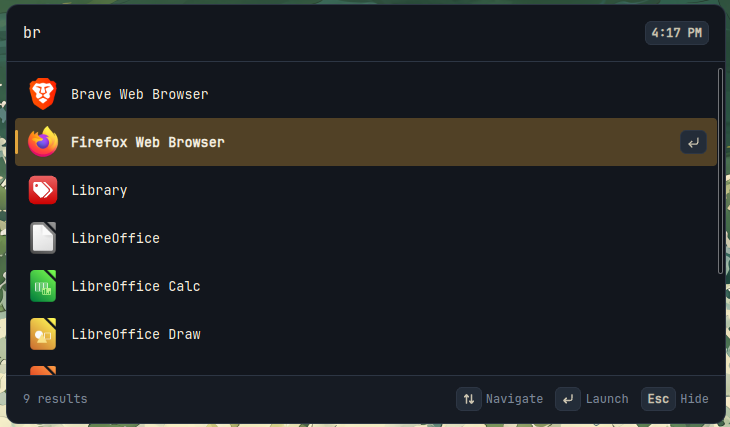

<div align="center">


# owl

### most definitely a launcher

<p>
    <a href="https://github.com/Vignesh-Venkatesh/owl/releases">
        
    </a>
  <!--<a href="https://github.com/Vignesh-Venkatesh/owl/releases">
    
  </a>-->
  
  
</p>

[Features](#features) • [Install](#install) • [Usage](#usage) • [Development](#development) • [Roadmap](#roadmap)

</div>

---

## What is owl?

owl is an application launcher.

It's early, small, and currently built around Linux and X11. The goal is to keep the launcher fast and simple while gradually adding things that are actually useful.

---

<p align="center">
  
</p>

---

## Features

* **Quick access** - open owl from anywhere with a global shortcut.
* **Application search** - search through installed desktop applications as you type.
* **Command palette** - type `!` to browse and activate built in commands.
* **Command autocomplete** - press `Tab` while typing a command to complete or cycle through matching commands.
* **Calculator** - use `!calc`, `!cal`, `!calculator`, or `!math` to evaluate expressions.
* **Instant calculations** - type expressions such as `2+2` directly without entering command mode.
* **UUID generator** - use `!uuid` or `!guid` to generate UUID v4 values.
* **Themes** - use `!theme` or `!themes` to search and apply built in themes.
* **Persistent themes** - your selected theme is saved and restored between launches.
* **Color tools** - use `!color` to preview and convert HEX, RGB, RGBA, HSL, and HSLA colors.
* **Web navigation** - use `!web` to open URLs or search the web from owl.
* **Configurable web search** - choose your search engine through `config.toml`.
* **Copy results** - copy calculator, UUID, and color results directly to the clipboard.
* **Context aware shortcuts** - footer hints adapt to the current launcher mode and available actions.
* **Multi monitor aware** - owl opens on the monitor containing your cursor.
* **Current time** - the search bar displays your local time.
* **Keyboard first** - navigate results, activate commands, and launch apps without touching the mouse.
* **Stays out of the way** - launch something, press `Esc`, or focus another window and owl disappears.
* **Lightweight** - built with Tauri, Rust, React, and TypeScript.

## Usage

Press:

```text
Ctrl + Alt + Space
```

Start typing the name of an application:

```text
firefox
```

Or type `!` to open the command picker:

```text
!
```

Press `Tab` while typing a command to autocomplete it. If multiple commands match, repeated presses cycle through them.

### Calculator

Activate the calculator with:

```text
!calc
```

Aliases also work:

```text
!cal
!calculator
!math
```

Press `Space` after an exact command name or alias to activate it immediately:

```text
!calc 2*(3+4)
```

You can also calculate directly from normal search:

```text
2+2
```

Press `Enter` on a valid calculator result to copy it to the clipboard.

### UUID

Activate the UUID generator with:

```text
!uuid
```

The `!guid` alias also works:

```text
!guid
```

Press `Enter` to copy the generated UUID to the clipboard.

Press `Tab` to generate a new UUID while the command is active.

### Themes

Open the theme picker with:

```text
!theme
```

The `!themes` alias also works.

Start typing to filter themes:

```text
!theme nord
```

Use `↑` / `↓` to navigate and press `Enter` to apply a theme. Your selection is saved for future launches.

### Color

Activate the color tool with:

```text
!color
```

Enter a color in HEX, RGB, RGBA, HSL, or HSLA format:

```text
!color #e8a33d
!color rgb(232, 163, 61)
!color hsl(36, 80%, 57%)
```

Activating `!color` without a value generates a random color.

Press `Tab` to cycle between HEX, RGB, and HSL output formats.

Press `Enter` to copy the displayed value.

### Web

Open a URL directly:

```text
!web github.com
```

Full URLs also work:

```text
!web https://github.com/Vignesh-Venkatesh/owl
```

Anything that doesn't look like a URL is sent to your configured search engine:

```text
!web rust async traits
```

Schemeless URLs automatically use `https://`.

### Emoji data

Emoji data is generated from `emojibase-data` and checked into the repository.

Regenerate it with:

```bash
bun run build:emoji-data
```

### Keyboard shortcuts

```text
Ctrl + Alt + Space      Open / hide owl
↑ / ↓                   Navigate results
Enter                   Launch / select / apply / copy / open result
Space                   Activate an exact command from the command picker
Tab                     Autocomplete commands / run command-specific actions
Esc                     Go back / hide owl
```

## Install

> [!NOTE]
> owl is currently developed and tested on Linux.

Download the latest version from the [Releases](../../releases) page.

Linux builds are available as:

* `.AppImage`
* `.deb`
* `.rpm`

## Development

You'll need:

* [Bun](https://bun.sh/)
* [Rust](https://www.rust-lang.org/)
* [Tauri's system dependencies](https://v2.tauri.app/start/prerequisites/)

Clone the repository:

```bash
git clone https://github.com/Vignesh-Venkatesh/owl.git
cd owl
```

Install dependencies:

```bash
bun install
```

Run owl:

```bash
bun run tauri dev
```

Build it:

```bash
bun run tauri build
```

## Known issues

This is `v0.2.3`. Things will still be rough around the edges.

* Global shortcut support currently requires X11. Wayland is not yet supported.
* Some terminal applications may not launch correctly.
* owl has only been tested on Linux so far.
* Application discovery currently follows Linux desktop entry conventions.

If you find something broken, opening an issue is appreciated.

## Roadmap

No promises, but these are some things I'd like to explore:

* Better search and ranking
* More built in commands
* File search
* Emoji search
* Terminal application support
* Settings
* Plugins

## Built with

[Tauri](https://tauri.app/) •
[Rust](https://www.rust-lang.org/) •
[React](https://react.dev/) •
[TypeScript](https://www.typescriptlang.org/) •
[Vite](https://vite.dev/)

---

<div align="center">

**owl**. most definitely a launcher.

</div>
