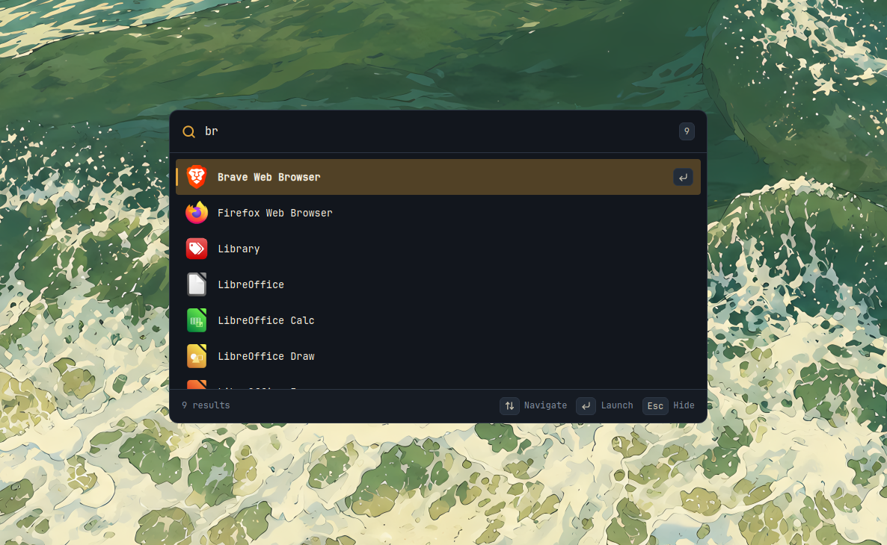
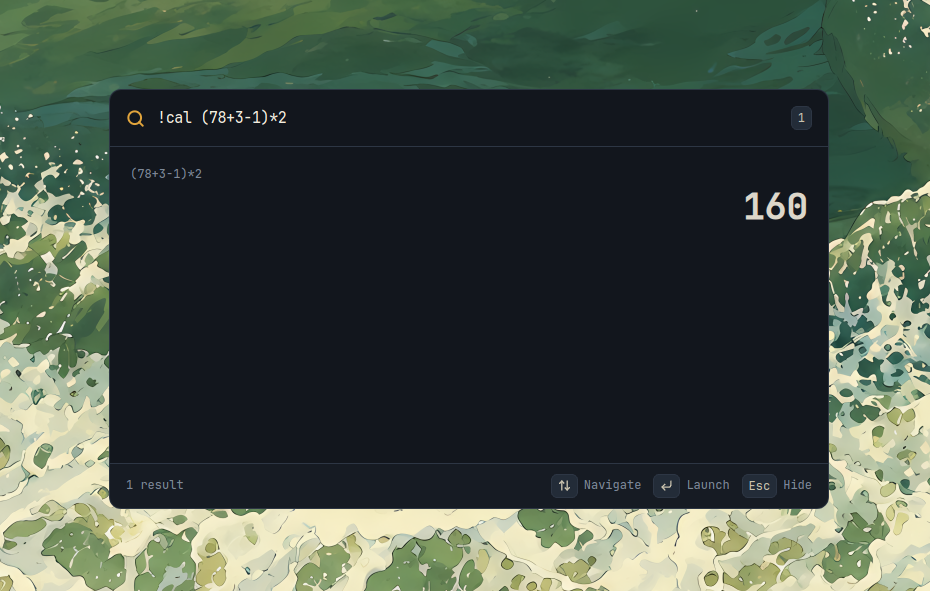

<div align="center">


# owl

### a launcher?

<p>
    <a href="https://github.com/Vignesh-Venkatesh/owl/releases">
        
    </a>
  <!--<a href="https://github.com/Vignesh-Venkatesh/owl/releases">
    
  </a>-->
  
</p>

[Features](#features) • [Install](#install) • [Usage](#usage) • [Development](#development) • [Roadmap](#roadmap)

</div>

---

## What is owl?

owl is an application launcher.

It's early, small, and currently built around Linux. The goal is to keep the launcher fast and simple while gradually adding the things that are actually useful.


<p align="center">
  
  
</p>


## Features

* **Quick access** - open owl from anywhere with a global shortcut.
* **Application search** - search through installed desktop applications as you type.
* **Command palette** - type `!` to browse and activate built in commands.
* **Calculator** - use `!calc`, `!cal`, `!calculator`, or `!math` to evaluate expressions.
* **Instant calculations** - type expressions such as `2+2` directly without entering command mode.
* **Copy results** - press `Enter` on a calculator result to copy it to the clipboard.
* **Keyboard first** - navigate results, activate commands, and launch apps without touching the mouse.
* **Stays out of the way** - launch something or press `Esc` and owl disappears.
* **Lightweight** - built with Tauri, Rust, React, and TypeScript.

## Usage

Press:

```text
Ctrl + Alt + Space
```

Start typing the name of an application:

```text
firefox
```

Or type `!` to open the command picker:

```text
!
```

### Calculator

Activate the calculator with:

```text
!calc
```

Aliases also work:

```text
!cal
!calculator
!math
```

Press `Space` after an exact command name or alias to activate it immediately:

```text
!calc 2*(3+4)
```

You can also calculate directly from normal search:

```text
2+2
```

Press `Enter` on a valid calculator result to copy it to the clipboard.

### Keyboard shortcuts

```text
Ctrl + Alt + Space      Open / hide owl
↑ / ↓                   Navigate results
Enter                   Launch app / activate command / copy calculator result
Space                   Activate an exact command from the command picker
Esc                     Exit command mode / hide owl
```

## Install

> [!NOTE]
> owl is currently developed and tested on Linux.

Download the latest version from the [Releases](../../releases) page.

Linux builds are available as:

* `.AppImage`
* `.deb`
* `.rpm`

## Development

You'll need:

* [Bun](https://bun.sh/)
* [Rust](https://www.rust-lang.org/)
* [Tauri's system dependencies](https://v2.tauri.app/start/prerequisites/)

Clone the repository:

```bash
git clone https://github.com/Vignesh-Venkatesh/owl.git
cd owl
```

Install dependencies:

```bash
bun install
```

Run owl:

```bash
bun run tauri dev
```

Build it:

```bash
bun run tauri build
```

## Known issues

This is `v0.2.0`. Things will still be rough around the edges.

* Footer shortcuts don't yet update when entering command mode.
* Calculator copy actions don't currently show a success notification.
* Some terminal applications may not launch correctly.
* owl has only been tested on Linux so far.
* Application discovery currently follows Linux desktop entry conventions.

If you find something broken, opening an issue is appreciated.

## Roadmap

No promises, but these are some things I'd like to explore:

* Better search and ranking
* More built in commands
* File search
* Emoji search
* Web search
* Terminal application support
* Settings
* Plugins

## Built with

[Tauri](https://tauri.app/) •
[Rust](https://www.rust-lang.org/) •
[React](https://react.dev/) •
[TypeScript](https://www.typescriptlang.org/) •
[Vite](https://vite.dev/)

---

<div align="center">

**owl**. A launcher?

</div>
