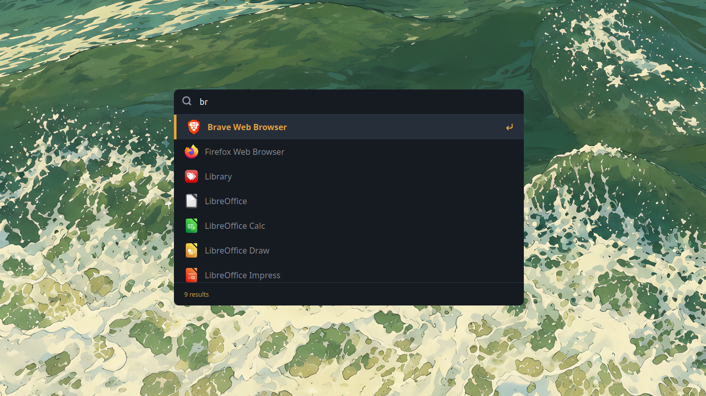

<div align="center">


# owl

### an app launcher for now

[Features](#features) • [Install](#install) • [Usage](#usage) • [Development](#development) • [Roadmap](#roadmap)

</div>

---

## What is owl?

owl is an application launcher.

It's early, small, and currently built around Linux. The goal is to keep the launcher fast and simple while gradually adding the things that are actually useful.


<p align="center">
  
</p>


## Features

- **Quick access** — open owl from anywhere with a global shortcut.
- **Application search** — search through installed desktop applications as you type.
- **Keyboard first** — navigate results and launch apps without touching the mouse.
- **Stays out of the way** — launch something or press `Esc` and owl disappears.
- **Lightweight** — built with Tauri, Rust, React, and TypeScript.

## Usage

Press:

```text
Ctrl + Alt + Space
```

Start typing the name of an application.

```text
Ctrl + Alt + Space      Open / hide owl
↑ / ↓                   Navigate results
Enter                   Launch selected app
Esc                     Hide owl
```


## Install

> [!NOTE]
> owl is currently developed and tested on Linux.

Download the latest version from the [Releases](../../releases) page.

Linux builds are available as:

- `.AppImage`
- `.deb`
- `.rpm`

## Development

You'll need:

- [Bun](https://bun.sh/)
- [Rust](https://www.rust-lang.org/)
- [Tauri's system dependencies](https://v2.tauri.app/start/prerequisites/)

Clone the repository:

```bash
git clone https://github.com/Vignesh-Venkatesh/owl.git
cd owl
```

Install dependencies:

```bash
bun install
```

Run owl:

```bash
bun run tauri dev
```

Build it:

```bash
bun run tauri build
```

## Known issues

This is `v0.1.0`. Things will be rough around the edges.

- Some terminal applications may not launch correctly.
- owl has only been tested on Linux so far.
- Application discovery currently follows Linux desktop entry conventions.

If you find something broken, opening an issue is appreciated.

## Roadmap

No promises, but these are some things I'd like to explore:

- Better search and ranking
- Terminal application support
- Calculator
- File search
- Commands
- Settings
- Plugins

## Built with

[Tauri](https://tauri.app/) •
[Rust](https://www.rust-lang.org/) •
[React](https://react.dev/) •
[TypeScript](https://www.typescriptlang.org/) •
[Vite](https://vite.dev/)

---

<div align="center">

**owl**. An app launcher for now.

</div>
